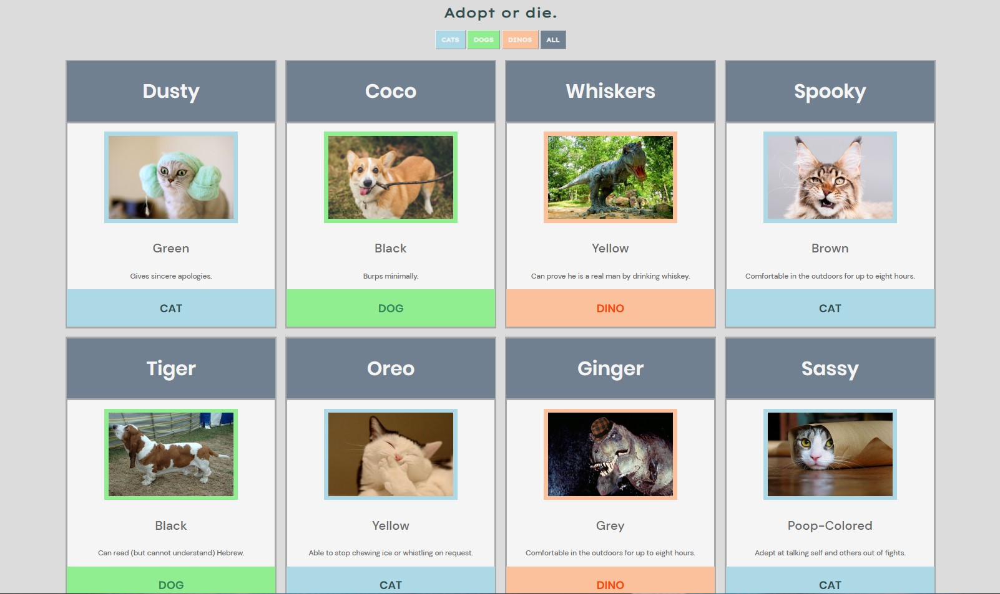
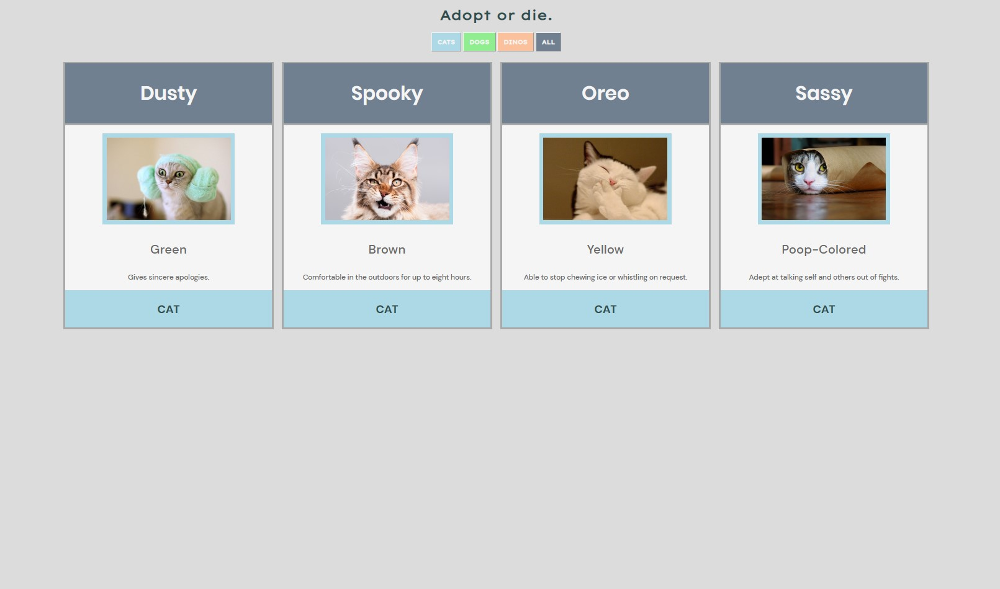
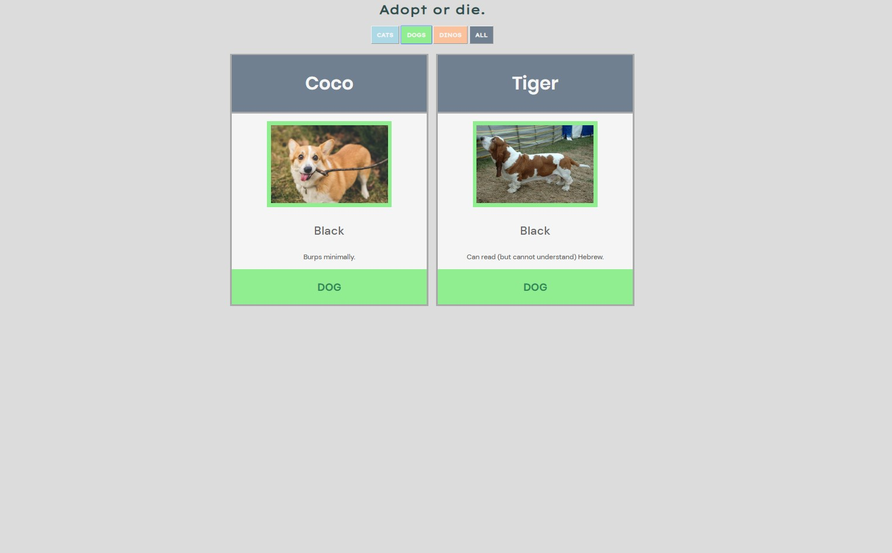
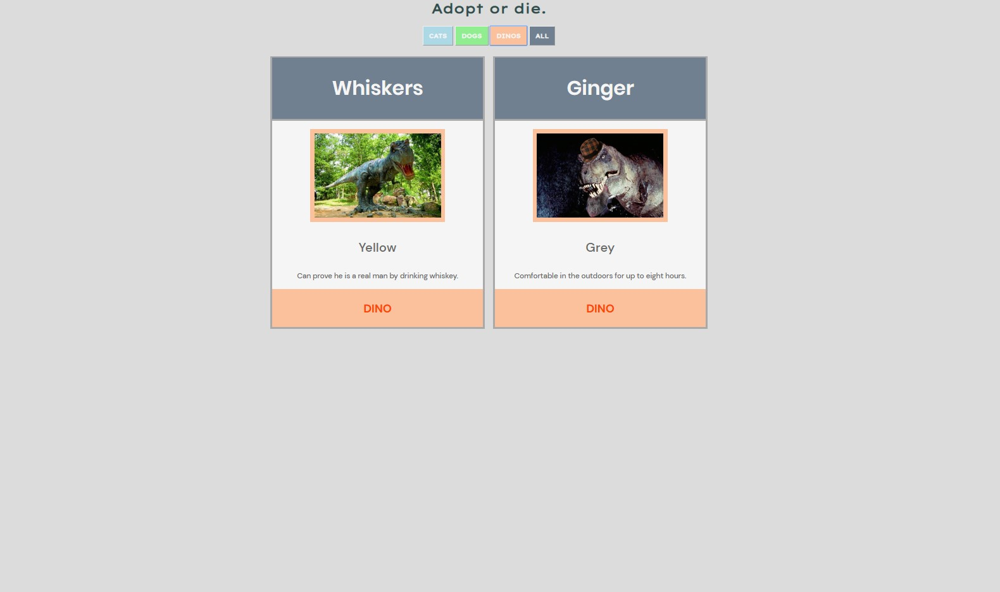
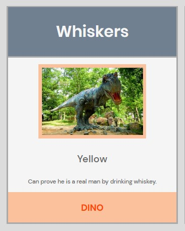

# NSS E12 Exercise - Pet Adoption Site

## Description:
The second exercise at NSS. The goal of the exercise was to create a pet adoption site using print to dom JS. Included with this excercise were the goals to tailor code to specific categories and create a category JS filter using an event listener. 

## Screenshots:
##### Main Grid View:

##### Filtered Grid Views:

##### Single Card View:

## How To Run:
>1. Clone down this repo.
>1. Install [http-server](https://www.npmjs.com/package/http-server).
>1. Navigate to folder in command line and type `http-server -p 8080`.
>1. Go to `http://localhost:8080` in your browser.